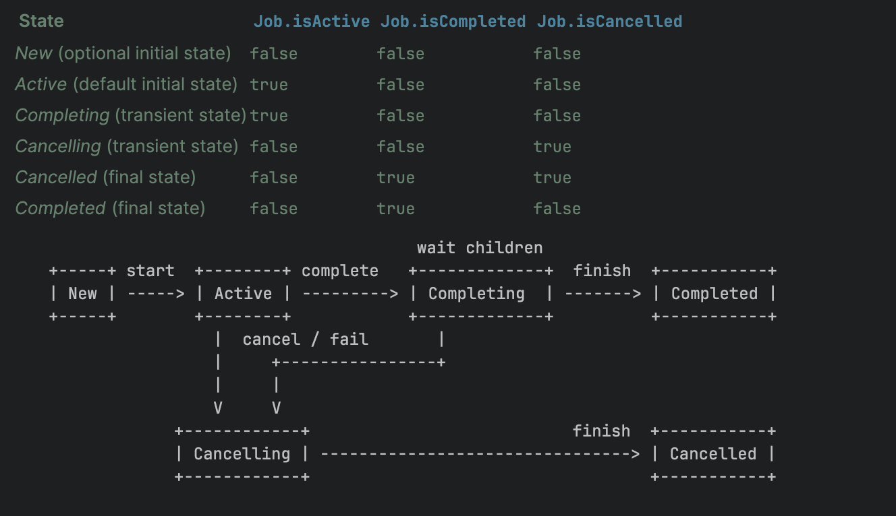

# CoroutineContext

Каждая корутина выполняется в каком-то контексте. Этот контекст представляется классом ***CoroutineContext***. *CoroutineContext* напоминает *Map<Key, Element>*

Каждый *CoroutineContext.Element* имеет уникальный *CoroutineContext.Key*.

***CoroutineContext*** - является набором параметров для выполнения корутины (на каком диспатчере, с каким именем корутины, с каким типом джобы и т.п.) Т.е. через контекст мы конфигурируем нашу корутину.
Создавать явно контекст не нужно, т.к. обычно он задается либо в скоупе, либо определяется при запуске корутин. Также можно объединить несколько контекстов в один. Например при объединении двух контекстов leftContext + rightContext значения будут объединены, а значения с одинаковыми Key будут взяты из rightContext.
Все стандартные корутин-билдеры принимают на вход CoroutineContext, однако он не используется, а лишь происходит его сложение с контекстом из CoroutineScope, в котором будет запускаться корутина. Далее будет описание основных представителей ***CoroutineContext***.

# Job. Объект корутины

Представляет собой выполняемую задачу. Возвращается методом ***launch***. Запуск корутины через ***async*** возвращает объект типа ***Deferred***, который расширяет интерфейс ***Job***. С помощью ***Job*** мы можем управлять работой корутины, джобу можно отменить, она имеет свой ЖЦ, и на основе неё можно организовать иерархию родитель-ребенок.
Жизненный цикл джоб состоит из 6 состояний:

Получить состояние в виде какой-то константы нельзя но можно проверить с помощью нескольких флагов, которые формируют понимание состояния. (Можно воспользоваться кастомным расширением [***Job.state***](https://github.com/ZharovVV/KotlinSandbox/blob/master/src/main/kotlin/com/github/zharovvv/coroutines/lesson2/CoroutoneContextExample.kt)) Каждая джоба может иметь родительскую джобу. Иерархическая организация джобов позволяет связывать между собой корутины и является важной частью *structured concurrency*. Такая организация джобов между собой имеет также несколько важных особенностей:

- отмена джобы приводит к рекурсивной отмене всех её дочерних джоб.
- также это работает и в обратном порядке в случае возникновения ошибки (*CancellationException* не считается ошибкой). Например если возниклпа ошибка в ходе выполнения дочерней джобы, это приведет к ошибке в родительской джобе, а она в свою очередь отменит другие свои дочерние джобы. Чтобы такое поведение не происходило и отменялась только дочерняя джоба, в которой произошла ошибка, необходимо использовать специальную реализацию джоб - ***SupervisorJob***. (В принципе она является основной).

# Поток для корутины

Один из самых популярных элементов контекста является ***CoroutineDispatcher***, который отвечает за то на каком потоке (или потоках!!) будет выполняться соответствующая ему корутина. Стандартные диспетчеры можно найти в классе ***Dispatchers***.

- **`*Dispatchers.Default***` - стандартный диспатчер, который используется всеми билдерами корутин, такими как ***launch*** и ***async***, если не указан какой-либо другой в *coroutineContext*. Обычно его стоит использовать только для интенсивных вычислительных операций, либо для переноса задач в фон. Количество потоков в пуле соответствует **количеству ядер в процессоре**, но оно никогда **не может быть меньше 2-х**. Стоит обратить внимание, что данный диспетчер не будет вызван по умолчанию, если билдер корутин был вызван из runBlocking (скорее всего это так ??).
- **`*Dispatchers.IO*`** - специальный диспатчер, который предназначен для выполнения IO-операций на специальном, выделенном под это дело пуле потоков. По умолчанию используется количество потоков, равное **количетсву ядер процессора**, но **не меньше 64**. Такое количство обусловлено тем, что зачастую IO-операции простаивают и не нагружают сильно систему, в отличие от *Dispatchers.Default*. Поэтому нужно множество потоков для выполнения таких операций, чтобы не было простоя и частых блокировок.
- **`*Dispatchers.Main*`** - специальный диспатчер, который выполняет работу на главном потоке. Важно, что данный диспетчер по умолчанию не определен и при попытке к нему обратится будет крэш приложения. Чтобы этого не произошло нужно добавить какую-нибудь зависимость, где есть понятие MainCoroutineDispatcher. (Например coroutines-android). Также можно создать данный диспатчер самостоятельно (что делать не рекомендуется). Kotlin использует **`*ServiceLoader*`** для загрузки класса `MainDispatcherFactory`. Для создания своего диспатчера необходимо написать реализацию `MainDispatcherFactory` и указать ссылку на неё в файле *resources/META-INF/services/kotlinx.coroutines.internal.MainDispatcherFactory.*
- **`*Dispatchers.Unconfined*`** - диспатчер, который не привязан к какому-либо потоку. Выполнение корутины происходит в том же потоке, в котором происходит её создание и запуск. А после вызова первой *suspend*-функции корутина продолжит выполнение в контексте из этой suspend функции. Этот диспатчер нужен лишь только потому что по умолчанию у каждой корутины используется default диспатчер, приводящий к смене потока выполнения (и если мы этого не хотим - то используем Dispatchers.Unconfined). Его также используют в тестах.

Лучше всего не использовать *Dispatcher*-ы напрямую. А лучше создавать свою собственную обертку и с помощью DI инжектить диспатчер, чтобы потом было легко подменить диспатчер в тестах.

# Перхват ошибок

`CoroutineExceptionHandler` - обработчик ошибок. Можно сказать, что это catch-блок для корутины. Если обработчик не бросает исключений, то исключение не будет проброшено дальше до родителя. `CoroutineExceptionHandler` не перехватывает `*CancellationException*`.

# `CoroutineName`

`CoroutineContext.Element`, который позволяет добавить корутине имя. Удобно для дебага.