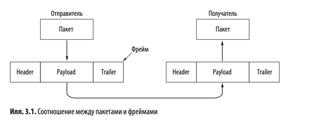
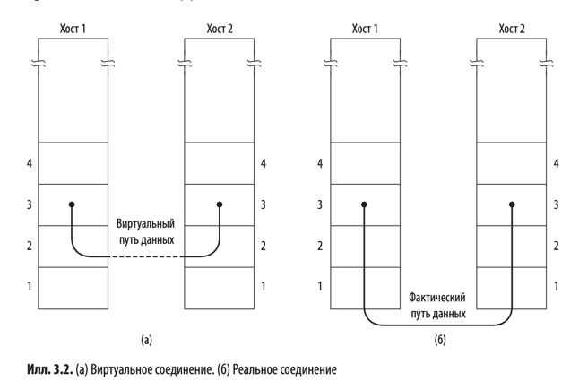
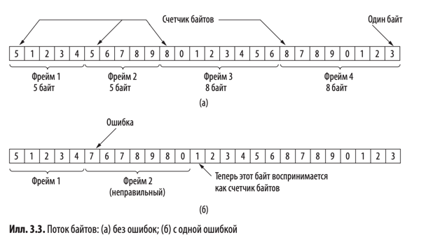
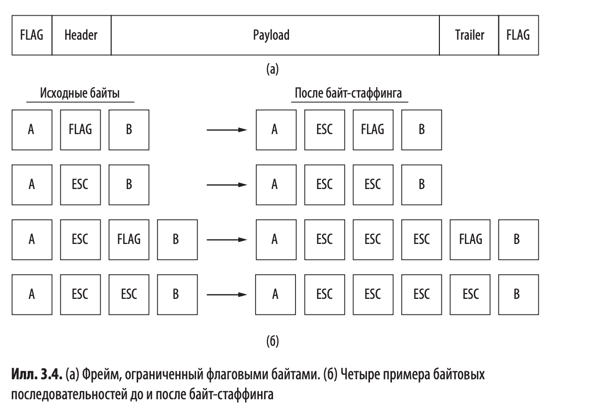
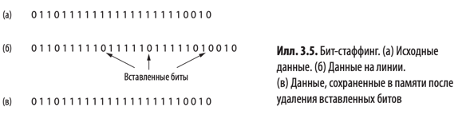
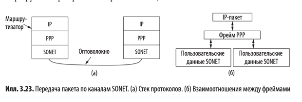
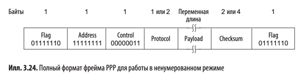
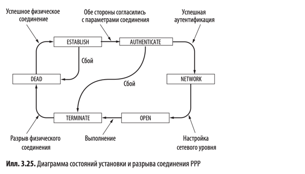

# Канальный уровень

## 3.1. Ключевые вопросы проектирования канального уровня

Канальный уровень использует определенные службы нижележащего физического уровня для отправки и получения битов по
потенциально ненадежным коммуникационным каналам, которые могут терять данные. У него есть ряд специфических функций. К
ним относятся:

1. Обеспечение строго очерченного служебного интерфейса для сетевого уровня.
2. Формирование отдельных фреймов из последовательностей байтов.
3. Обнаружение и исправление ошибок передачи.
4. Управление потоком данных, исключающее "затопление" медленных приемников быстрыми передатчиками.

Для этих целей канальный уровень берет пакеты, полученные с сетевого уровня, и вставляет их в специальные
__фреймы (frames)__, также называемые кадрами, для передачи. В каждом фрейме содержатся поля _Header_ (Заголовок),
_Payload_ (Полезная нагрузка/Пользовательские данные) и _Trailer_ (Трейлер). Структура фрейма показана на илл 3.1.
Управление фреймами - это основная задача канального уровня.

> Контроль ошибок, управление потоками и другие функции канального уровня (представленные в этой главе) во многих сетях
> на самом деле являются прерогативой верхних уровней и вообще не относятся к канальному уровню, который выполняет лишь
> простейшие задачи.

### 3.1.1. Службы, предоставляемые сетевому уровню

Задача канального уровня заключается в предоставлении служб сетевому. Основная служба канального уровня заключается в
обмене данными между сетевыми уровнями отправляющего и целевого устройств. На сетевом уровне отправителя находится некая
сущность (назовем её процессом), которая передает пакеты на канальный уровень для их дальнейшей отправки по назначению.
Канальный уровень должен отправить данные адресату так, чтобы они достигли его сетевого уровня, как показано на илл.
3.2 (а). В действительности данные передаются по пути, показанному на илл. 3.2 (б) (Уровень 1 - Физический), однако
проще представить себе два канальных уровня, которые связываются друг с другом с помощью протокола передачи данных.

Канальный уровень может предоставлять различные службы. Их набор может отличаться в разных протоколах. Как правило,
встречаются следующие варианты:

1. Служба без подтверждений и без установки соединения (Ethernet).
2. Служба с подтверждениями и без установки соединения (802.11 Wi-Fi).
3. Служба с подтверждениями, ориентированная на установление соединения (самый надежный тип, который подходит для
   длинных ненадежных связей, таких как спутниковый канал или междугороднее телефонное соединение).

### 3.1.2. Формирование фрейма

Для обслуживания сетевого уровня канальный уровень использует службы, предоставляемые ему физическим уровнем. Физический
уровень принимает необработанный поток битов и пытается передать его по назначению. Если канал зашумлен, то на
физическом уровне добавляются избыточные сигналы, чтобы снизить количество ошибок до допустимого уровня. Однако поток
битов, получаемый на уровне передачи данных, не застрахован от ошибок. У некоторых битов могут быть другие значения,
количество принятых битов может быть меньше, равно или больше числа преданных. Канальный уровень должен обнаружить
ошибки и, если нужно, исправить их.

Обычно канальный уровень разделяет поток битов на отдельные фреймы и вычисляет для каждого из них короткий маркер,
называемый контрольной суммой. Контрольная сумма добавляется во фрейм перед тем, как он пересылается дальше. Когда
целевое устройство получает фрейм, контрольная сумма вычисляется заново на его основе. Если она отличается от
содержащейся во фрейме, то канальный уровень понимает, что при передаче произошла ошибка, и принимает меры (например,
игнорирует испорченный фрейм и посылает отправляющему устройству сообщение об ошибке).

Разбиение потока битов на отдельные фреймы представляет собой более сложную задачу, чем это может показаться на первый
взгляд. В книге представлены четыре метода маркировки границ фреймов.

| Метод маркировки границ фрейма                     | Принцип работы                                                                                                                                                                                                                                                                                                                                                                                                                                                             | Преимущества                                                                                                                               | Недостатки                                                                                                                                                                                                                                                 |
|----------------------------------------------------|----------------------------------------------------------------------------------------------------------------------------------------------------------------------------------------------------------------------------------------------------------------------------------------------------------------------------------------------------------------------------------------------------------------------------------------------------------------------------|--------------------------------------------------------------------------------------------------------------------------------------------|------------------------------------------------------------------------------------------------------------------------------------------------------------------------------------------------------------------------------------------------------------|
| Подсчет байтов                                     | Указание количества байтов фрейма в поле заголовка. Канальный уровень на принимающем устройстве видит это поле, узнает, сколько байтов последует, и таки образом определяет, где находится конец фрейма. См. илл. 3.3.                                                                                                                                                                                                                                                 | Простота.                                                                                                                                  | При передаче может быть искажен сам счетчик.                                                                                                                                                                                                               |
| Флаговые байты с байт-стаффингом                   | Начало и конец каждого фрейма маркируются специальными байтами (называемыми __флаговыми__).  Для избежания ситуации, когда в передаваемых данных может встретиться последовательность, используемая в качестве флагового байта, перед флаговым байтом (FLAG) размещают специальный экранирующий/escape символ (ESC). Такой же символ добавляют и перед ESC. Канальный уровень получателя вначале убирает ESC, а затем передает фрейм на сетевой уровень. См. илл. 3.4. | Решает недостатки метода выше.                                                                                                             | Обязывает использовать исключительно 8-битные байты (Фрейм может разделяться только на байты, но не на биты).  Длина фрейма зависит от содержимого (Чем больше FLAG и ESC в данных, тем длиннее (больше) будет передаваемый фрейм из-за экранирования. |
| Использование сигнальных битов с бит-стаффингом    | Каждый фрейм начинается и завершается специальной последовательностью битов 01111110 (или 0x7E в шестнадцатеричной системе). При этом если в битовом потоке встретится 5 единиц подряд уровень передачи данных автоматически вставит в выходной поток нулевой бит (это уже бит-стаффинг).                                                                                                                                                                                  | Делить данные на фреймы можно на уровне битов. Причем фреймы могут содержать произвольное число битов и состоять из блоков любого размера. | Длина фрейма зависит от содержимого, однако уже не так сильно как при байт-стаффинге.                                                                                                                                                                      |
| Применение запрещенных сигналов физического уровня | На физическом уровне уже итак добавляются избыточные биты (в 4В/5В 16 из 32 возможных сигналов не используются). Суть этого метода заключается в том, чтобы как раз использовать некоторые из этих зарезервированных сигналов для обозначения границ фрейма.                                                                                                                                                                                                               |                                                                                                                                            |                                                                                                                                                                                                                                                            |

## 3.2. Обнаружение и коррекция ошибок

Существует две основные стратегии для борьбы с ошибками:

1. __Корректирующие коды (упреждающая коррекция ошибок, Forward Error Correction, FEC)__
2. __Коды для обнаружения ошибок__

### 3.2.1. Корректирующие коды

1. Коды Хэмминга ([Подробнее тут](https://habr.com/ru/articles/140611/)).
2. Двоичные сверточные коды.
3. Коды Рида-Соломона.
4. Коды с малой плотностью проверок на четность.

### 3.2.2. Коды для обнаружения ошибок

1. Код с проверкой на четность.
2. Код с контрольными суммами.
3. Циклический избыточный код (CRC).

## 3.5. Практическое использование протоколов канального уровня

В интернете в качестве основного протокола линий "точка-точка" используется __PPP (Point-to-Point Protocol)__. С помощью
этого протокола пакеты передаются по множеству типов соединений, включая каналы SONET в глобальных сетях и ADSL для
домашних подключений. Для предоставления доступа в интернет по имеющейся сети кабельного телевидения используется
протокол DOCSIS.

### 3.5.1. Передача пакетов по каналам SONET

SONET - это протокол физического уровня, наиболее часто используемый в оптоволоконных каналах, которые составляют
магистраль различных коммуникационных сетей, включая телефонную. SONET обеспечивает строго определенную скорость
передачи данных (например, 2,4 Гбит/с в канале OC-48). Поток битов организован в виде пакетов фиксированного размера,
которые посылаются каждые 125 мкс, независимо от наличия в них пользовательских данных.

Чтобы передавать пакеты по таким каналам, необходим некоторый механизм формирования фреймов, способный отличать
возникающие иногда пакеты от непрерывного потока битов, в котором они передаются. Для этого на IP-маршрутизаторах
работает протокол PPP, как показано на илл. 3.23.

Формат фрейма PPP показан на илл. 3.24.

Все PPP-фреймы начинаются со стандартного флагового байта протокола HDLC 0x7E (01111110).

Далее идет поле _Address_, которому всегда присваивается двоичное значение 11111111; это означает, что все станции
должны принимать этот фрейм.

За полем адреса следует поле _Control_ (Управляющее поле), его значение по умолчанию равно 00000011. Это число означает
ненумерованный фрейм.

Четвертое поле фрейма PPP - _Protocol_. Оно определяет тип пакета, который содержится в поле _Payload_. Номера,
начинающиеся с бита 0, отведены для IP версий 4 и 6, а также других протоколов сетевого уровня, таких как IPX и
AppleTalk. С бита 1 начинаются коды, используемые в конфигурационных протоколах PPP, включая LCP (Протокол управления
каналом) и различные NCP (сетевые протоколы управления) для каждого поддерживаемого протокола сетевого уровня. Размер
поля _Protocol_ по умолчанию составляет 2 байта, однако путем переговоров с помощью LCP он может быть уменьшен до одного
байта.

Поле _Payload_ может быть переменной лины, вплоть до некоторого оговоренного максимального значения (по умолчанию 1,5
кбайта).

Следом за _Payload_ располагается поле _Checksum_ (Контрольная сумма). В обычном состоянии оно занимает 2 байта, но в
случае необходимости по договоренности может занимать четыре. Четырехбайтная контрольная сумма фактически представляет
собой 32-битный код CRC. Двухбайтная контрольная сумма также является стандартным кодом CRC.

Перед тем как предавать фреймы PPP по каналу SONET, необходимо установить и настроить соединение PPP. Этапы, через
которые проходит линия связи при ее установлении, использовании и разъединении, показаны на илл. 3.25. 

Изначально линия в состоянии DEAD.