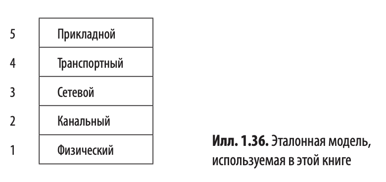

# Введение

### Службы и протоколы


`Уровень` - это абстрактный слой, отвечающий за определённую часть задач,
связанных с передачей данных между устройствами в сети.
Каждый уровень имеет чётко определённые функции, использует службы нижележащего уровня
и предоставляет свои службы вышележащему.
_Например: Физический, Канальный, Транспортный и т.п._

`Службы` - это набор примитивов (операций; _напр. `LISTEN`, `CONNECT`, `ACCEPT`, `SEND` ..._), которые нижележащий
уровень может делать для вышележащего.
Служба описывает операции, которые уровень может выполнять для своих пользователей, но при этом не упоминается о том,
как эти операции реализуются.
Служба описывает интерфейс между двумя уровнями, один из которых (расположенный ниже) является поставщиком службы, а
другой (расположенный непосредственно над первым) - её потребителем.

`Протокол` - представляет собой набор правил, определяющих формат и смысл пакетов (сообщений), которыми обмениваются
сущности внутри одного уровня. Протоколы используются такими сущностями для реализации описаний служб. Они могут менять
протоколы, как им заблагорассудится, главное - не менять видимую пользователям службу.

__Другое определение (ChatGPT):__

`Служба` - это функциональность, предоставляемая одним уровнем другому.

`Интерфейс` - взаимодействие между уровнями одной модели на устройстве.

`Протокол` - набор правил для взаимодействия уровней между разными устройствами.

## Эталонные модели

### Эталонная модель OSI


| Плюсы                                                                                                                                                                                                                                                                                | Минусы                                                                                  |
|:-------------------------------------------------------------------------------------------------------------------------------------------------------------------------------------------------------------------------------------------------------------------------------------|:----------------------------------------------------------------------------------------|
| Четкое разграничение понятий `интерфейс`, `служба`, `протокол`. Каждый уровень предоставляет вышележащему уровню какие-либо службы. Определение службы говорит лишь о том, что делает данный уровень, но не о том, как вышележащие уровни взаимодействуют с ним или как он работает. | Стандарты разрабатывались в неподходящий момент времени (см. "апокалипсис двух слонов") |
|                                                                                                                                                                                                                                                                                      | Плохая архитектура: и модель, и её протоколы несовершенны по своей сути.                |
|                                                                                                                                                                                                                                                                                      | Неудачная реализация                                                                    |
|                                                                                                                                                                                                                                                                                      | Неудачная политика                                                                      |

### Эталонная модель TCP/IP

Эталонная модель TCP/IP использовалась в прародителе всех глобальных вычислительных сетей - ARPANET и его наследнике -
всемирной сети интернет.
С учетом требований (_Пентагон хотел, чтобы соединения поддерживались до тех пор, пока работают отправляющее и целевое
устройства, даже если некоторые узлы или линии передачи между ними внезапно вышли из строя_) была выбрана сеть с
__коммутацией пакетов__, основанная на уровне без соединений, работающем в различных сетях.


#### Канальный уровень (link layer)

Низший уровень модели TCP/IP. Описывает, какими должны быть каналы связи (например, последовательные линии связи и
традиционный Ethernet) для удовлетворения потребностей межсетевого уровня без сетей.

#### Межсетевой уровень (internet layer)

Краеугольный камень всей архитектуры. Его задача сделать так, чтобы хосты
могли внедрять пакеты в произвольную сеть для последующего движения к пункту назначения (возможно, расположенного в
другой сети) независимо друг от друга. Эти пакеты даже могут прибывать совершенно не в том порядке, в каком они были
отправлены. Если необходимо соблюдение очередности, высшие уровни должны упорядочить пакеты.

Межсетевой уровень определяет официальный формат пакетов, **IP (Internet Protocol - межсетевой протокол)**, а также
вспомогательный протокол
**ICMP (Internet Control Message Protocol - протокол управления межсетевым обменом сообщениями)**.
Задача межсетевого уровня заключается в доставке IP-пакетов по месту назначения. Главная проблема состоит в
маршрутизации пакетов, а также в контроле перегруженности сети. Задача маршрутизации в основном уже решена, но
справиться с перегруженностью нельзя без помощи вышележащих уровней.

#### Транспортный уровень (transport layer)

Данный уровень был создан для обеспечения связи объектов одного ранга, расположенных на разных хостах, аналогично
транспортному уровню OSI. В нем определено два сквозных транспортных протокола.
Первый, **TCP (Transmission Control Protocol - протокол управления передачей данных)**,- надежный, ориентированный на
установление соединения протокол, с помощью которого можно доставить без ошибок байтовый поток с одного компьютера на
любой другой. Он разбивает входящий поток на отдельные сообщения и передает их по одному в межсетевой уровень. В пункте
назначения получающий TCP-процесс собирает полученные сообщения в выходной поток. TCP также управляет движением данных,
чтобы быстрый отправитель не перегрузил медленного получателя чрезмерным числом сообщений.

Второй протокол этого уровня, **UDP (User Datagram Protocol - протокол пользовательских дейтаграмм)**, представляет
собой ненадежный протокол без соединений. Он предназначен для приложений, которым не требуется TCP для разбиения на
сообщения и управления потоками; они выполняют данную задачу сами (или обходятся без этого). **UDP** также широко
применяется для однократных клиент-серверных запросов и приложений, работающих по принципу "запрос/ответ". Для таких
приложений важнее быстрота доставки, чем её точность, например, в случае передачи голоса или видео.


#### Прикладной уровень (application layer / уровень приложений)

Он включает все высокоуровневые протоколы. Самые первые протоколы подобного рода - протокол виртуального терминала
TELNET (Teletype network), протокол передачи файлов FTP (File transfer protocol) и протокол электронной почты SMTP (
Simple mail transfer protocol). В дальнейшем к ним добавилось множество других.

| Плюсы                                                         | Минусы                                                                                                                                                                                                                                                             |
|:--------------------------------------------------------------|:-------------------------------------------------------------------------------------------------------------------------------------------------------------------------------------------------------------------------------------------------------------------|
| Протоколы, повсеместно используемые на протяжении многих лет. | В этой модели нет достаточно явного разграничения понятий служб, интерфейсов и протоколов. Вследствие этого модель TCP/IP не может применяться в качестве основы для проектирования сетей с применением новых технологий.                                          |
|                                                               | Модель TCP/IP не слишком универсальна и не подходит для описания любых других стеков протоколов, кроме TCP/IP. Например описать Bluetooth с помощью модели TCP/IP невозможно.                                                                                      |
|                                                               | Канальный уровень вообще не является уровнем в обычном понимании этого термина в контексте многоуровневых протоколов. Это интерфейс (между сетевым и уровнем передачи данных). Различие между интерфейсом и уровнем критически важно, небрежности тут недопустимы. |
|                                                               | Нет различия между физическим уровнем и уровнем передачи данных.__*__                                                                                                                                                                                              |
|                                                               | Многие ранние протоколы были сделаны на скорую руку и распространялись бесплатно. Что привело к их повсеместному использованию и глубокому внедрению в повседневную практику. В результате они плохо поддаются замене.                                             |

__*__ _Физический уровень связан с характеристиками передачи информации по медному кабелю, оптоволокну или беспроводными
средствами. Задача уровня передачи данных состоит в определении начала и конца фреймов (или кадров) и отправка их с
одной стороны на другую с надлежащей степенью надежности._

### Модель, используемая в этой книге



В данной книге применяется гибридная модель.

* Физический уровень определяет способ передачи битов по различным средам в виде электрических (или прочих аналоговых)
  сигналов.
* Канальный уровень имеет дело с пересылкой сообщений конечной длины между непосредственно соединенными устройствами с
  заданной степенью надежности. (Пример протоколов данного уровня: Ethernet, 802.11 (Wi-Fi))
* Сетевой уровень занимается объединением каналов связи в сети и интерсети для пересылки пакетов между удаленными
  компьютерами. Сюда входит поиск пути пересылки пакетов. (Пример протокола этого уровня - IP)
* Транспортный уровень повышает предоставляемые сетевым уровнем гарантии доставки. Чаще всего это выражается в
  увеличении надежности предоставлении абстракций доставки (например, надежного байтового потока), подходящих для нужд
  различных приложений. Пример протокола - TCP.
* На прикладном уровне располагаются программы подключающиеся к сети. (Пример: HTTP, а также вспомогательные программы,
  например DNS)

## Стандартизация

__Стандарты__ описывают, __что требуется для совместимости с другими продуктами__ - ни больше ни меньше.
Это способствует расширению рынка и росту конкуренции между компаниями на основе качества программных продуктов.
Например, стандарт 802.11 описывает несколько скоростей передачи данных. При этом он не указывает, при каких
обстоятельствах отправитель должен использовать конкретную скорость, что является ключевым фактором для высокой
производительности. Это решение отдается на откуп создателю продукта.

Стандарты делятся на две категории: де-факто и де-юре. Стандарты __де-факто__ просто возникают сами собой, без
какого-либо предварительного плана _(HTTP, Bluetooth)_.

Внедрение стандартов _де-юре_ напротив, происходит на основе правил, описанных неким официальным комитетом
стандартизации.

`ITU (International Telecommunication Union)` - Международный союз электросвязи (МСЭ).
Его задача - стандартизация международных телекоммуникаций.
МСЭ включает три основных сектора:

* `ITU-T` - сектор стандартизации электросвязи, который занимается телефонными системами и системами передачи данных.
* `ITU-R` - сектор радиосвязи, занимается глобальной координацией использования радиочастот заинтересованными группами.
* `ITU-D` - сектор развития. Он занимается созданием благоприятных условий для развития информационных технологий и
  технологий связи. Его цель - сокращение "цифровых барьеров" между странами с эффективным доступом к информационным
  технологиям и странами с ограниченным доступом к ним.

Задача __ITU-T__ состоит в выпуске технических рекомендаций относительно интерфейсов для телефонной и телеграфной связи,
а также обмена данными. Эти рекомендации нередко становятся стандартами, признанными на международном уровне
_(H.264/MPEG-4 AVC - для сжатия видеоданных, X.509 - сертификаты открытых ключей)_.

`ISO (International Standards Organization)` - Международная организация по стандартизации.
Общественная неправительственная организация, основанная в 1946 году.

ISO публикует стандарты, затрагивающие огромный спектр вопросов - от болтов и гаек до покраски телефонных столбов
(рыболовных сетей, женского нижнего белья). В вопросах телекоммуникации ISO и ITU-T часто сотрудничают (ISO состоит в
ITU-T) во избежание конфликта двух официальных и взаимно несовместимых международных стандартов.

`IEEE (Institute of Electrical and Electronics Engineers` - Институт инженеров электротехники и электроники - крупнейшее
профессиональное объединение в мире. _(Пример: Комитет 802 IEEE стандартизовал множество видов LAN.)_

```
            IAB
            ↙ ↘
        IRTF   IETF
```

`Internet Architecture Board (IAB)` - Совет по деятельности в сфере интернета.
IAB состоит из `IRTF (Internet Research Task Force - Исследовательская группа интернет-технологий)` и
`IETF (Internet Engineering Task Force - Инженерный совет интернета)`.

__IRTF__ сосредоточена на долгосрочных исследованиях, а __IETF__ - на краткосрочных инженерных проектах.

Жизненный цикл стандарта (публикуемого IETF под эгидой ISOC (Internet Society - Общества Интернета)):

1. Internet Draft
2. Proposed Standard (RFC получает свой номер)
3. Draft Standard
4. Internet Standard

`World Wide Web Consortium, W3C - Консорциум Всемирной паутины` разрабатывает веб-стандарты, протоколы и руководства,
обеспечивающие долгосрочное развитие Всемирной паутины.