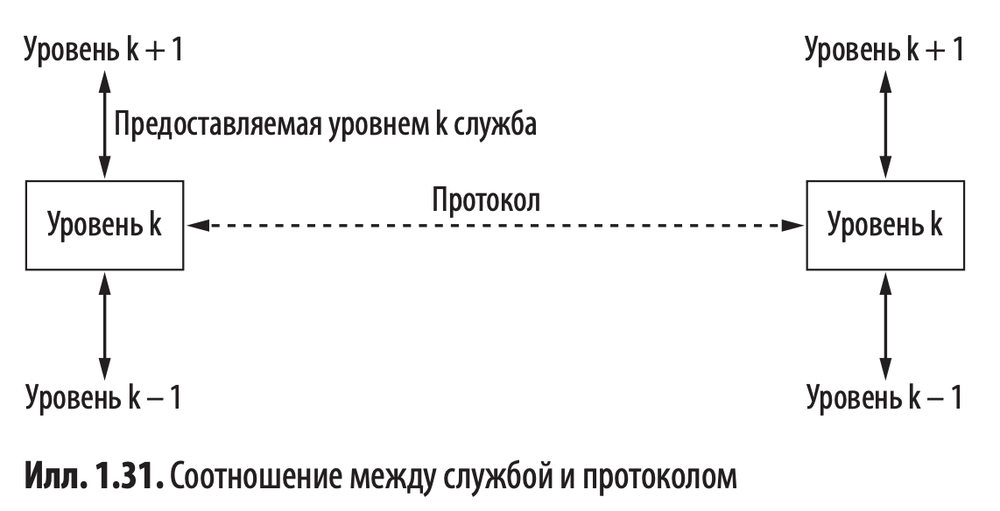

# Введение

### Службы и протоколы

`Уровень` - это абстрактный слой, отвечающий за определённую часть задач,
связанных с передачей данных между устройствами в сети.
Каждый уровень имеет чётко определённые функции, использует службы нижележащего уровня
и предоставляет свои службы вышележащему.
_Например: Физический, Канальный, Транспортный и т.п._

`Службы` - это набор примитивов (операций; _напр. `LISTEN`, `CONNECT`, `ACCEPT`, `SEND` ..._), которые нижележащий
уровень может делать для вышележащего.
Служба описывает операции, которые уровень может выполнять для своих пользователей, но при этом не упоминается о том,
как эти операции реализуются.
Служба описывает интерфейс между двумя уровнями, один из которых (расположенный ниже) является поставщиком службы, а
другой (расположенный непосредственно над первым) - её потребителем.

`Протокол` - представляет собой набор правил, определяющих формат и смысл пакетов (сообщений), которыми обмениваются
сущности внутри одного уровня. Протоколы используются такими сущностями для реализации описаний служб. Они могут менять
протоколы, как им заблагорассудится, главное - не менять видимую пользователям службу.

__Другое определение (ChatGPT):__

`Служба` - это функциональность, предоставляемая одним уровнем другому.

`Интерфейс` - взаимодействие между уровнями одной модели на устройстве.

`Протокол` - набор правил для взаимодействия уровней между разными устройствами.

## Эталонные модели

### Эталонная модель OSI

| Плюсы                                                                                                                                                                                                                                                                                | Минусы                                                                                  |
|:-------------------------------------------------------------------------------------------------------------------------------------------------------------------------------------------------------------------------------------------------------------------------------------|:----------------------------------------------------------------------------------------|
| Четкое разграничение понятий `интерфейс`, `служба`, `протокол`. Каждый уровень предоставляет вышележащему уровню какие-либо службы. Определение службы говорит лишь о том, что делает данный уровень, но не о том, как вышележащие уровни взаимодействуют с ним или как он работает. | Стандарты разрабатывались в неподходящий момент времени (см. "апокалипсис двух слонов") |
|                                                                                                                                                                                                                                                                                      | Плохая архитектура: и модель, и её протоколы несовершенны по своей сути.                |
|                                                                                                                                                                                                                                                                                      | Неудачная реализация                                                                    |
|                                                                                                                                                                                                                                                                                      | Неудачная политика                                                                      |

### Эталонная модель TCP/IP

