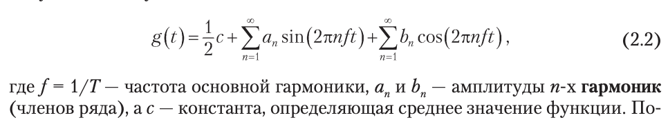
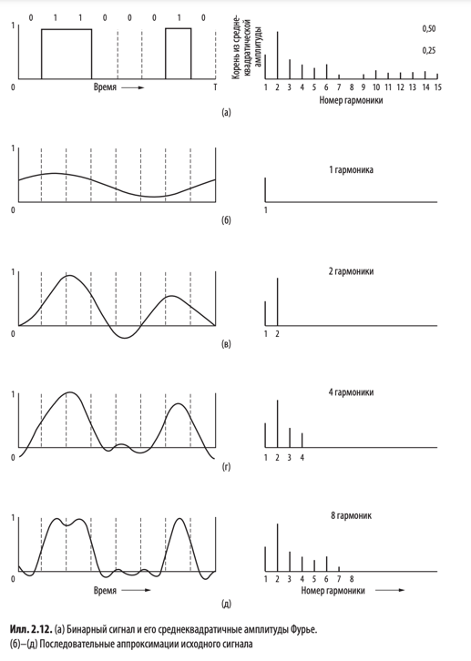
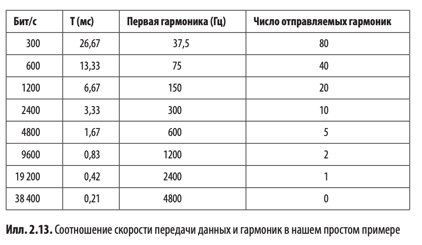
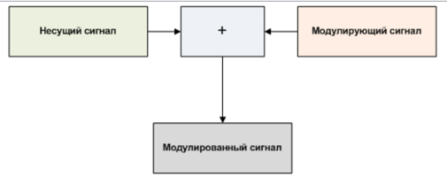
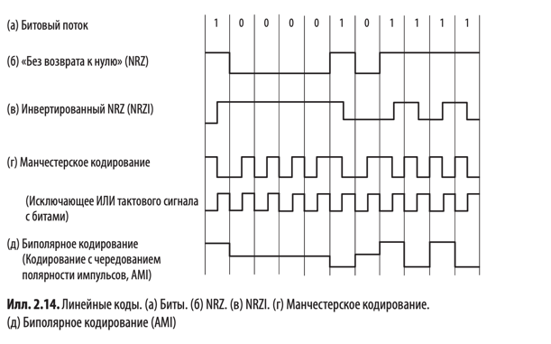
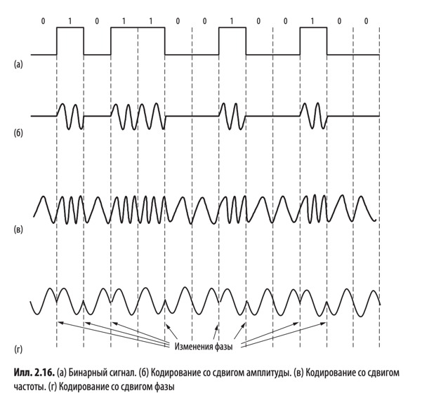
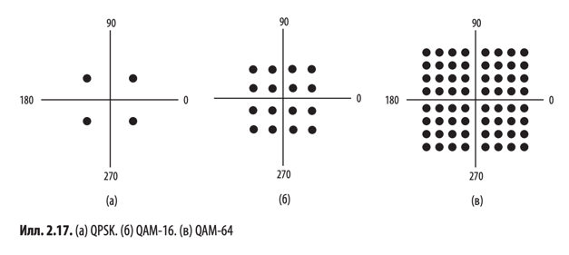

# Физический уровень

Задача физического уровня - перенос битов с одного устройства на другое.

## 2.1. Проводные среды передачи данных

Среды передачи с использованием физического кабеля или провода часто называются __проводными__,
или __направляемыми (guided transmission media)__, поскольку в них сигнал направлен по физическому пути.
Виды:

* Запоминающее устройство (грузовик с жесткими дисками)
* Витая пара
* Коаксиальный кабель
* ЛЭП
* Оптоволокно

## 2.2. Беспроводная передача данных

## 2.4. От форм волн к битам

### 2.4.1. Теоретические основы обмена данными

Информацию можно передавать по проводам путем варьирования какой-либо физической величины, например напряжения или силы
тока. Если представить значение напряжения или силы тока в виде однозначной функции времени `f(t)` можно смоделировать
поведение сигнала и проанализировать его математически.

#### Гармонический анализ

В начале XIX столетия французский математик Жан-Батист Фурье доказал, что любую обычную периодическую функцию `g(t)` с
периодом `T` можно представить в виде суммы ряда (возможно, бесконечного) синусов и косинусов:

Подобное разложение называется __рядом Фурье__. Функцию можно восстановить по её ряду Фурье.
Другими словами, зная период `T` и амплитуды, можно восстановить исходную функцию времени путем вычисления сумм
уравнения (2.2).

Если принять исходный сигнал за функцию `g(t)`, то выходной сигнал (на приемнике) будет
представлен `n` первыми членами ряда Фурье (гармониками). Получается, что чем больше `n`, тем более близок будет
выходной сигнал к исходной функции `g(t)`.
Однако, из формулы (2.2) видно, что чем больше `n`, тем больше циклическая частота `2𝛑nf`.

Обычно амплитуды передаются по проводам практически в неизменном виде от нуля до некой частоты `fc`, а все частоты сверх
этой частоты среза ослабляются.
> __Ширина полосы пропускания__ или __пропускная способность (bandwidth)__ - ширина диапазона частот передаваемых
> практически без затухания. На практике это диапазон частот от `N` до `N + B`, где `N + B` - это частота, на которой
> мощность полученного сигнала падает вдвое.

Пропускная способность - физическое свойство среды передачи, зависящее от конструкции, толщины, длины и материала
провода или оптоволокна, а также других факторов. Для её дальнейшего ограничения нередко применяются фильтры.

> Таким образом, полоса пропускания определяет сколько гармоник из ряда Фурье сигнала может пройти через систему. Чем
> уже полоса, тем сильнее искажается сигнал из-за потери высокочастотных компонент.

Сигналы, охватывающие частоты от 0 до максимальной частоты, называются __немодулированными (baseband signal)__. А
сигналы, смещенные по спектру на более широкий диапазон частот, как в случае всех проводных передач данных,
называются __полосовыми сигналами (passband signals)__.

Из илл. 2.12. видно (пример отправки ASCII-символа "b", закодированного в виде 8-битного числа 01100010), что достаточно
8 гармоник для восстановления отправленной последовательности битов (конкретно для этого примера).

В нашем случае для отправки 8 бит (по 1 биту за раз) при скорости передачи данных `b бит/с` понадобится `8/b с`.
Таким образом частота первой гармоники этого сигнала равна `f = 1/T = b/8 Гц` (второй - `2 * b/8` ... n-ой - `n * b/8`).
Если ширина полосы пропускания равна `B` Гц, то номер высшей гармоники будет равен `B / (b/8) = 8 * B/b`.

Конкретные значения для некоторых скоростей передачи данных приведены на илл. 2.13.
_(В примере ширина полосы пропускания принята равной 3 кГц)_

Из этих чисел понятно, что чем выше скорость, тем меньше число отправляемых гармоник (менее четкий прием).
Очевидно, что при скоростях выше 38,4 Кбит/с использовать бинарные сигналы невозможно, даже если канал полностью
свободен от шума. Другими словами, установление предела пропускной способности ограничивает скорость передачи данных,
даже если каналы идеальны.

### 2.4.2. Максимальная скорость передачи данных по каналу

> __Теорема дискретизации (Теорема Найквиста-Шеннона-Котельникова)__:
> Любой сигнал с ограниченной полосой _B_ может быть полностью восстановлен, если частота дискретизации _fs_
> удовлетворяет условию: _fs ≥ 2B_.

Из теоремы выше, можно доказать 👇
> _Теорема Найквиста_
> 

При наличии случайного шума ситуация резко ухудшается. Из-за движения молекул в системе случайный (тепловой) шум
присутствует всегда. Объем теплового шума измеряется в виде отношения мощности сигнала к мощности шума и называется
__отношением сигнал/шум (Signal-to-Noise Ratio, SNR)__. Если обозначить мощности сигнала _S_, а мощность шума - _N_, то
отношение сигнал/шум равно _S/N_. Обычно эта величина указывается на логарифмической шкале в виде `10 log(S/N)`,
поскольку может варьироваться в очень широких пределах. Единицы этой логарифмической шкалы названы __децибелами (дБ)__.
Отношение S/N для 10 равно 10 дБ, 100 - 20 дБ, 1000 - 30 дБ и т.д.

> Основной результат, полученный Шенноном: максимальная скорость передачи данных (пропускная способность) зашумленного
> канала с полосой пропускания _B_ Гц и отношением сигнал/шум _S/N_ равна:
> 

### 2.4.3. Цифровая модуляция (манипуляция)

Определение по книге:
> Процесс преобразования битов в сигнал. Наоборот - демодуляция.

Чуть больше теории 👇
>
> __Модуляция__ - процесс изменения одного или нескольких параметров модулируемого несущего сигнала при помощи
> модулирующего сигнала. Передаваемая информация заложена в модулирующем сигнале, а роль переносчика информации
> выполняет высокочастотное колебание, называемое несущим (модулируемым). Модуляция, таким образом, представляет собой
> процесс "посадки" информационного колебания на заведомо известную несущую с целью получения нового модулированного
> сигнала.
>
> 

#### Передача в базовой полосе

Сигнал занимает частоты от нуля до максимума, возможного при данной скорости передачи.

В простейшем варианте цифровой модуляции 1 бит выражается положительным напряжением, а 0 бит - отрицательным, как
показано на илл. 2.14 (а).
В случае оптоволокна наличие светового импульса соответствует "1", а его отсутствие - "0". Схема носит название
__NRZ (Non-Return-to-Zero)__.

На практике данная схема применяется редко. Существуют более сложные схемы преобразования битов в сигналы, лучше
отвечающие инженерным соображениям, — __линейные коды__. Ниже описаны линейные коды, которые повышают эффективность
полосы пропускания, а также обеспечивают восстановление синхронизации и баланс постоянного тока.

> __Скорость передачи символов, symbol rate, baud rate, бодрейт__ - скорость, с которой меняется сигнал.

> __Скорость передачи в битах, битрейт, bit rate__ равен скорости передачи символов, умноженный на количество битов в
> символе.

#### Восстановление тактового (синхронизационного) сигнала. Симметричные сигналы.

В любой схеме преобразования битов в символы приемник должен знать, где кончается один символ и начинается следующий,
чтобы правильно декодировать биты.

> __Симметричные сигналы__ - сигналы, в которых доля положительного напряжения равна доле отрицательного даже за
> короткий промежуток времени. Такие сигналы также называют __балансными__.
> Их среднее значение равно нулю, а значит, в них отсутствует составляющая постоянного тока. Это является преимуществом,
> поскольку некоторые каналы связи (например коаксиальный кабель и линии с трансформаторами) сильно ослабляют
> составляющую постоянного тока из-за их физических свойств. Кроме того, при подключении приемника к каналу связи
> методом емкостного соединения передается только переменная составляющая тока. В любом случае при отправке сигнала с
> ненулевым средним значением только впустую тратится энергия, ведь составляющая постоянного тока будет отфильтрована.

| Линейный код               | Принцип работы / Заметки                                                                                                                                                                                                     | Преимущества                                                                                                                                                               | Недостатки                                                                                                                                                                                                                                                                | 
|:---------------------------|------------------------------------------------------------------------------------------------------------------------------------------------------------------------------------------------------------------------------|:---------------------------------------------------------------------------------------------------------------------------------------------------------------------------|:--------------------------------------------------------------------------------------------------------------------------------------------------------------------------------------------------------------------------------------------------------------------------|
| NRZ                        | Сигнал формируется в соответствии с данными.                                                                                                                                                                                 | Простота.                                                                                                                                                                  | Сигнал может быть несимметричным (будет присутствовать составляющая постоянного тока).  При длинной последовательности 0 или 1 неизбежны ошибки (нужен точный синхросигнал, что очень затратно).                                                                      |
| Манчестерское кодирование  | Синхросигнал XOR Информационный сигнал = Манчестерское кодирование.  Использовался в раннем стандарте Ethernet.                                                                                                          | Решает проблемы NRZ.                                                                                                                                                       | Из-за тактового генератора полоса пропускания должна быть в два раза выше по сравнению с NRZ (частота тактового генератора должна быть в 2 раза выше частоты сигнала). То есть частота информационного сигнала будет ограничена половиной полосы пропускания (а не всей). |
| NRZI (Инвертированный NRZ) | "1" кодируется в виде тактового перехода, а "0" - отсутствие тактового перехода.  Используется в стандарте USB.                                                                                                          | Решает проблему длинных цепочек из 1, используя всю полосу пропускания для информационного сигнала.                                                                        | Сигнал может быть несимметричным.  Не решает проблему длинных цепочек из 0.                                                                                                                                                                                           |
| 4B/5B                      | Каждой группе из 4 бит соответствует 5-битный паттерн на основе фиксированной таблицы преобразования.  5-битные паттерны подобраны таким образом, что последовательности из более че 3 нулей невозможны.                 | Решает проблемы NRZ, используя всю полосу пропускания.                                                                                                                     | Сигнал может быть несимметричным.                                                                                                                                                                                                                                         |
| Скремблирование            | Операция XOR с псевдослучайной последовательностью, которая применяется к данным до их передачи. Для восстановления настоящих данных приемник применяет к входящему потоку XOR с той же псевдослучайной последовательностью. | Не требуем избыточной полосы пропускания и дополнительного времени. Предотвращает попадание энергии сигнала в преобладающие гармоники, излучающие электромагнитные помехи. | Не гарантирует отсутствия длинных цепочек (маловероятно, но полностью исключить это нельзя)                                                                                                                                                                               |
| Биполярное кодирование     | Способ реализации симметричного кода. Для отправки "1" передатчик чередует уровни +1 В и -1 В, чтобы среднее значение всегда было нулевым.                                                                                   |                                                                                                                                                                            |                                                                                                                                                                                                                                                                           |
| 8B/10B                     | 8 бит входного сигнала соотносится с 10 битами выходного. (Симметричный аналог 4B/5B).                                                                                                                                       | Симметричный сигнал. Не будет более пяти последовательных единиц или нулей.                                                                                                |                                                                                                                                                                                                                                                                           |

#### Передача в полосе пропускания

При полосовой передаче сигналов цифровая модуляция производится путем модуляции несущего сигнала таким образом, чтобы он
располагался в нужной полосе частот. Модулировать можно амплитуду, частоту и фазу несущего сигнала. У всех этих методов
есть названия.

* __Кодирование со сдвигом амплитуды (Amplitude Shift Keying, ASK)__
* __Кодирование со сдвигом частоты (Frequency Shift Keying, FSK)__
* __Кодирование со сдвигом фазы (Phase Shift Keying, PSK)__

В усовершенствованной схеме, более эффективно использующей полосу пропускания, для передачи 2 бит информации на символ
применяется четыре сдвига, например, на 45, 135, 225 и 315 градусов. Такая версия называется
__квадратурным кодированием со сдвигом фазы (Quadrature Phase Shift Keying, QPSK)__.

Эти схемы можно сочетать между собой и использовать больше уровней для передачи большего числа битов на символ.
Как правило, совместно модулируют амплитуду и фазу.

На илл. 2.17 приведены три квадратурных диаграммы. Фаза каждой точки соответствует углу между положительной частью оси x
и примой, проведенной в эту точку из начала координат. Амплитуда каждой точки равна расстоянию от начала координат.

На илл. 2.17 (б) показана схема модуляции __QAM-16__,
где QAM - __квадратурная модуляция амплитуды (Quadrature Amplitude Modulation)__.
В ней используется 16 сочетаний амплитуд и фаз, так что эта схема модуляции пригодны для передачи 4 бит на символ.
Существуют QAM ещё более высокого порядка (QAM-64, QAM-256).

Для распределения битов по символам используется __код Грея__, чтобы небольшой всплеск шума на стороне приемника не
привел к большому количеству ошибок в битах. Суть этого кода заключается в том, что задаются такие соответствия битов
символам, чтобы соседние символы отличались только на 1 бит.

### 2.4.4. Мультиплексирование

> Мультиплексирование - уплотнение канала связи, то есть передача нескольких потоков данных с меньшей скоростью по
> одному физическому каналу связи. Иначе: создание в исходном канале связи нескольких подканалов связи с меньшей
> пропускной способностью.

Существует три способа мультиплексирования физического канала связи:

* Мультиплексирование с частотным разделение каналов, FDM
* Мультиплексирование по времени, TDM
* Мультиплексирование с кодовым разделением каналов, CDM
* Мультиплексирование по длинам волн, WDM (разновидность FDM для оптоволокна)

### 2.5.4. Коммутация

> Коммутация - процесс соединения абонентов данной сети через транзитные узлы.

Основные виды:

* Коммутация каналов
* Коммутация пакетов
