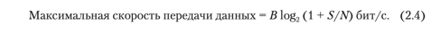

# Физический уровень

Задача физического уровня - перенос битов с одного устройства на другое.

## 2.1. Проводные среды передачи данных

Среды передачи с использованием физического кабеля или провода часто называются __проводными__,
или __направляемыми (guided transmission media)__, поскольку в них сигнал направлен по физическому пути.
Виды:

* Запоминающее устройство (грузовик с жесткими дисками)
* Витая пара
* Коаксиальный кабель
* ЛЭП
* Оптоволокно

## 2.2. Беспроводная передача данных

## 2.4. От форм волн к битам

### 2.4.1. Теоретические основы обмена данными

Информацию можно передавать по проводам путем варьирования какой-либо физической величины, например напряжения или силы
тока. Если представить значение напряжения или силы тока в виде однозначной функции времени `f(t)` можно смоделировать
поведение сигнала и проанализировать его математически.

#### Гармонический анализ

В начале XIX столетия французский математик Жан-Батист Фурье доказал, что любую обычную периодическую функцию `g(t)` с
периодом `T` можно представить в виде суммы ряда (возможно, бесконечного) синусов и косинусов:

Подобное разложение называется __рядом Фурье__. Функцию можно восстановить по её ряду Фурье.
Другими словами, зная период `T` и амплитуды, можно восстановить исходную функцию времени путем вычисления сумм
уравнения (2.2).

Если принять исходный сигнал за функцию `g(t)`, то выходной сигнал (на приемнике) будет
представлен `n` первыми членами ряда Фурье (гармониками). Получается, что чем больше `n`, тем более близок будет
выходной сигнал к исходной функции `g(t)`.
Однако, из формулы (2.2) видно, что чем больше `n`, тем больше циклическая частота `2𝛑nf`.

Обычно амплитуды передаются по проводам практически в неизменном виде от нуля до некой частоты `fc`, а все частоты сверх
этой частоты среза ослабляются.
> __Ширина полосы пропускания__ или __пропускная способность (bandwidth)__ - ширина диапазона частот передаваемых
> практически без затухания. На практике это диапазон частот от `N` до `N + B`, где `N + B` - это частота, на которой
> мощность полученного сигнала падает вдвое.

Пропускная способность - физическое свойство среды передачи, зависящее от конструкции, толщины, длины и материала
провода или оптоволокна, а также других факторов. Для её дальнейшего ограничения нередко применяются фильтры.

> Таким образом, полоса пропускания определяет сколько гармоник из ряда Фурье сигнала может пройти через систему. Чем
> уже полоса, тем сильнее искажается сигнал из-за потери высокочастотных компонент.

Сигналы, охватывающие частоты от 0 до максимальной частоты, называются __немодулированными (baseband signal)__. А
сигналы, смещенные по спектру на более широкий диапазон частот, как в случае всех проводных передач данных,
называются __полосовыми сигналами (passband signals)__.

Из илл. 2.12. видно (пример отправки ASCII-символа "b", закодированного в виде 8-битного числа 01100010), что достаточно
8 гармоник для восстановления отправленной последовательности битов (конкретно для этого примера).

В нашем случае для отправки 8 бит (по 1 биту за раз) при скорости передачи данных `b бит/с` понадобится `8/b с`.
Таким образом частота первой гармоники этого сигнала равна `f = 1/T = b/8 Гц` (второй - `2 * b/8` ... n-ой - `n * b/8`).
Если ширина полосы пропускания равна `B` Гц, то номер высшей гармоники будет равен `B / (b/8) = 8 * B/b`.

Конкретные значения для некоторых скоростей передачи данных приведены на илл. 2.13.
_(В примере ширина полосы пропускания принята равной 3 кГц)_

Из этих чисел понятно, что чем выше скорость, тем меньше число отправляемых гармоник (менее четкий прием).
Очевидно, что при скоростях выше 38,4 Кбит/с использовать бинарные сигналы невозможно, даже если канал полностью
свободен от шума. Другими словами, установление предела пропускной способности ограничивает скорость передачи данных,
даже если каналы идеальны.

### 2.4.2. Максимальная скорость передачи данных по каналу

> __Теорема дискретизации (Теорема Найквиста-Шеннона-Котельникова)__:
> Любой сигнал с ограниченной полосой _B_ может быть полностью восстановлен, если частота дискретизации _fs_
> удовлетворяет условию: _fs ≥ 2B_.

Из теоремы выше, можно доказать 👇
> _Теорема Найквиста_
> 

При наличии случайного шума ситуация резко ухудшается. Из-за движения молекул в системе случайный (тепловой) шум
присутствует всегда. Объем теплового шума измеряется в виде отношения мощности сигнала к мощности шума и называется
__отношением сигнал/шум (Signal-to-Noise Ratio, SNR)__. Если обозначить мощности сигнала _S_, а мощность шума - _N_, то
отношение сигнал/шум равно _S/N_. Обычно эта величина указывается на логарифмической шкале в виде `10 log(S/N)`,
поскольку может варьироваться в очень широких пределах. Единицы этой логарифмической шкалы названы __децибелами (дБ)__.
Отношение S/N для 10 равно 10 дБ, 100 - 20 дБ, 1000 - 30 дБ и т.д.

> Основной результат, полученный Шенноном: максимальная скорость передачи данных (пропускная способность) зашумленного
> канала с полосой пропускания _B_ Гц и отношением сигнал/шум _S/N_ равна:
> 

### 2.4.3. Цифровая модуляция

> Чуть больше теории 👇
>
> __Модуляция__ - процесс изменения одного или нескольких параметров модулируемого несущего сигнала при помощи
> модулирующего сигнала. Передаваемая информация заложена в модулирующем сигнале, а роль переносчика информации
> выполняет высокочастотное колебание, называемое несущим (модулируемым). Модуляция, таким образом, представляет собой
> процесс "посадки" информационного колебания на заведомо известную несущую с целью получения нового модулированного
> сигнала.
> 
> 

